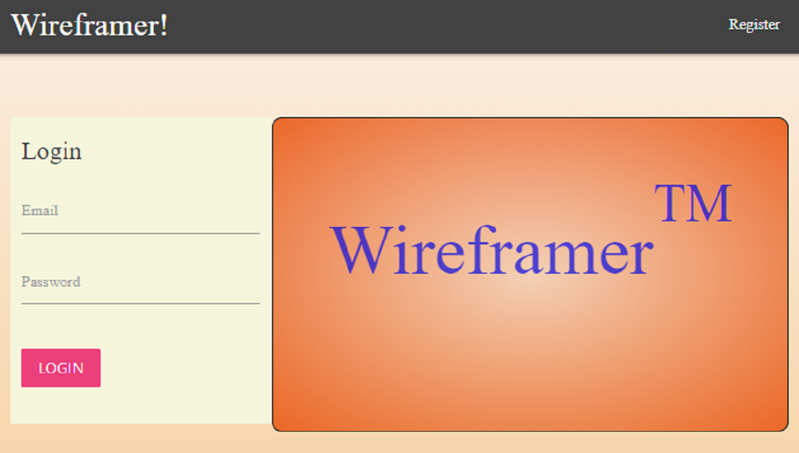
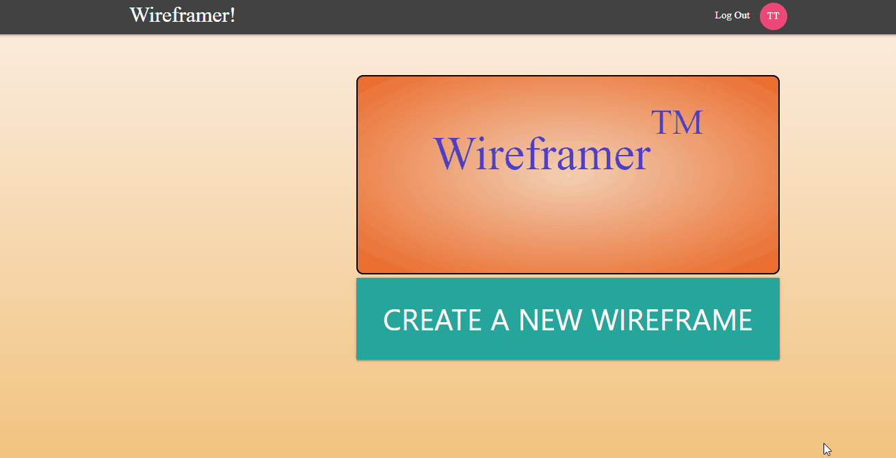

Wireframer is a website that allows users to create wireframes. Users can register an account, log into the account and make various changes. All data are saved on [Google Firebase](https://firebase.google.com/).

[Wireframer](leheng620.github.io/Wireframer/)

## Quick Start

### Login

#### If you just want to try it out without registering an account

Enter the following information in the login cridential:

> Email: 123@123.com
> 
> Password: 123456

This is a public account for demo use only.

#### Register an account

Go to the register page by clicking the register button at the top right corner.

### Create a wireframe

Click on the **Create a New Wireframe** button.

### Edit

**Adding Elements**

You can add an element buy clicking one of them on the left.

**Editing Elements**

Click on the element to select it first, then you can change the styles of the element on the right.

## To run this project locally:

1. Clone the repository
2. Navigate to /Wireframer
3. In the terminal: `npm install .` and `npm start`

This project was bootstrapped with [Create React App](https://github.com/facebook/create-react-app).